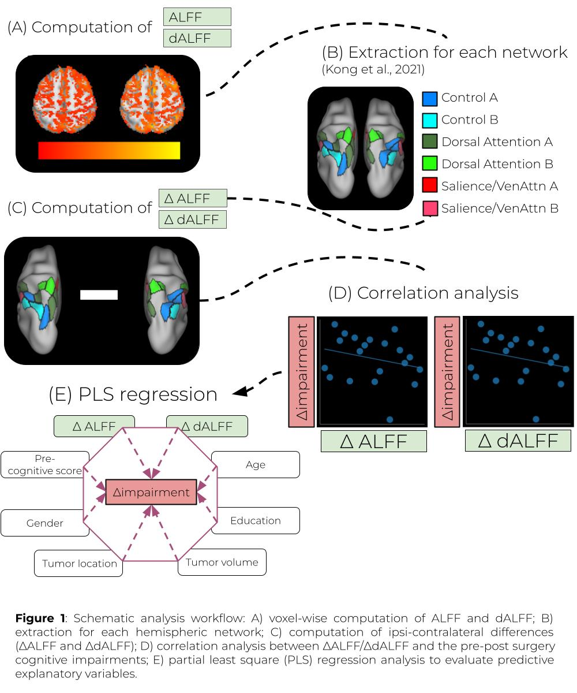
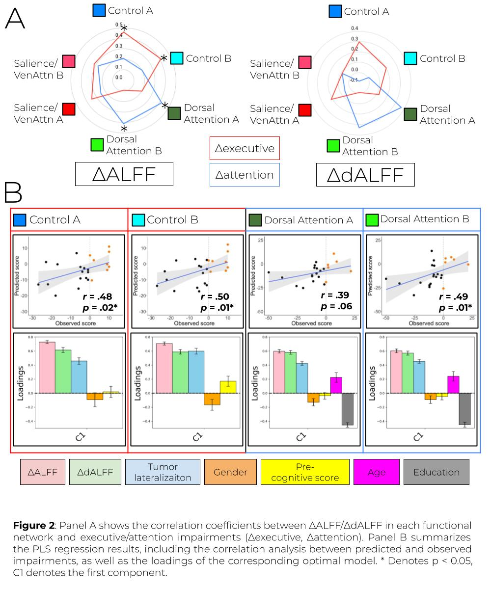

# ALGLIO

## Overview

This repository includes scripts used for predicting cognitive outcomes of post-surgical glioma patients.


## Table of Contents

1. [Objective](#objective)
2. [Publication](#publication)
3. [Directory Structure](#directory-structure)
4. [Contact](#contact)


## Objective

The objective of this project was to:
- Explore voxel-wise rs-fMRI analysis (ALFF/dALFF).
- Associate the rs-fMRI metrics with the post-surgical cognitive deterioration.

Methods:
- 23 glioma patients
- 1.5T MRI
- Structural MRI
- Resting-state fMRI
- Cognitive assessments

Figures:



## Publication

Under review

## Directory Structure
```bash
2024_ALGLIO/
    ├── images/ # include some figures
    │
    ├── README.md
    ├── ___.m # a Matlab script for eye-tracking data analysis
```

## Contact
If you have any questions, feel free to ask me!
 ```bash
kazuki@cbs.mpg.de
 ```
